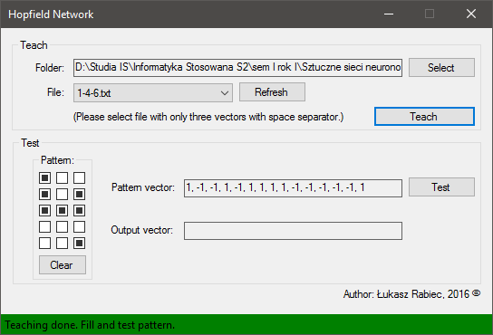
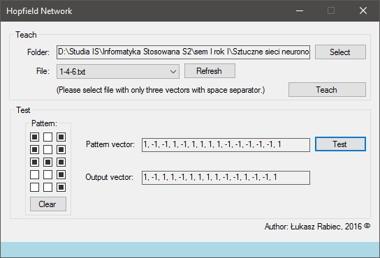
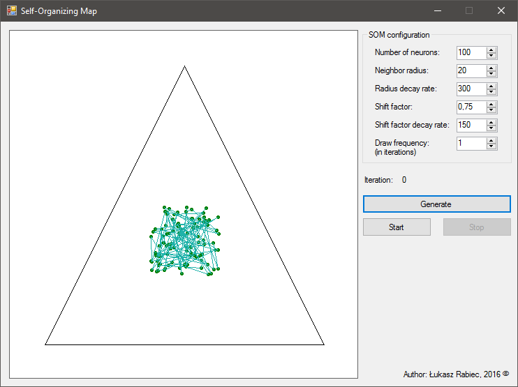
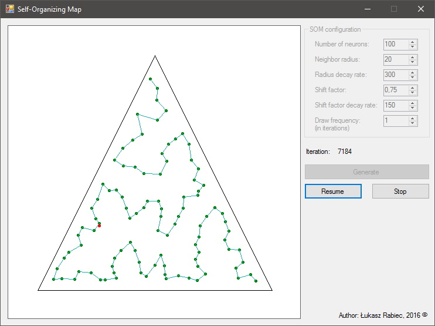
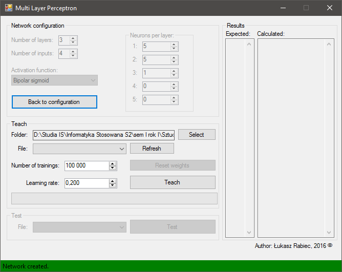
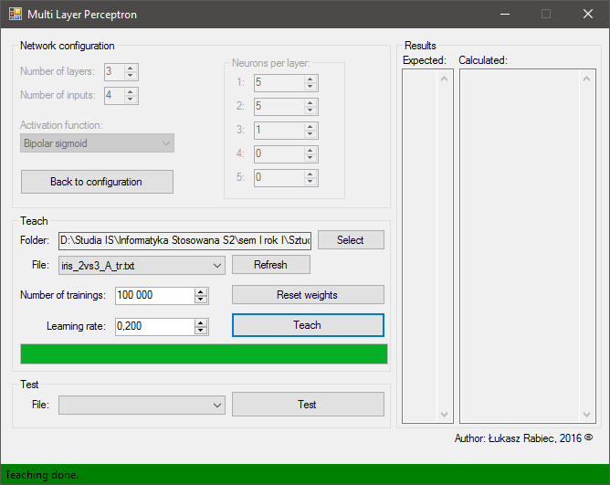
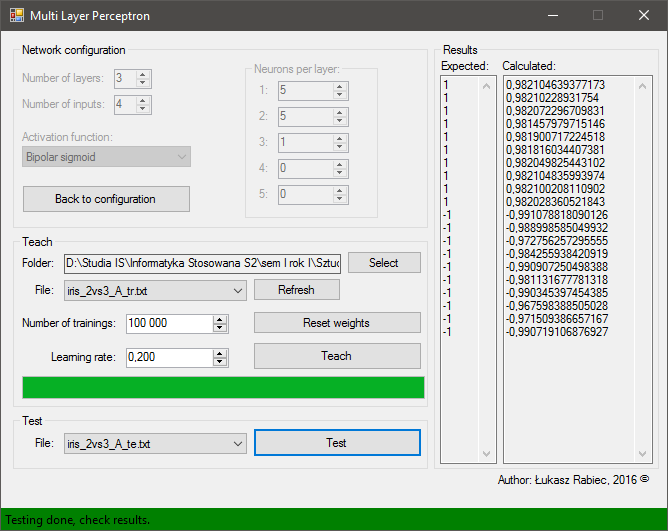
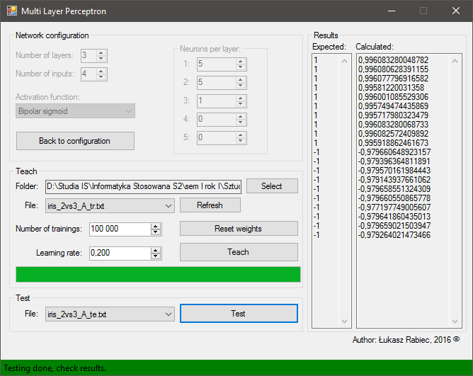

# NeuralNetworks
Artificial neural networks
- Binary Correlation Matrix (BCM) --> [Model](../master/NeuralNetworks/Models/BcmModel.cs) --> [Tests](../master/NeuralNetworks.Tests/BcmModelTests.cs)
- Bidirectional Associative Memory (BAM) --> [Model](../master/NeuralNetworks/Models/BamModel.cs) --> [Tests](../master/NeuralNetworks.Tests/BamModelTests.cs)
- Single Layer Perceptron (PLA - Pocket Learning Algorithm) --> [Model](../master/NeuralNetworks/Models/SingleLayerPerceptron.cs) --> [App](../master/SingleLayerPerceptronClient/Program.cs)
- Hopfield Network (Hebb's Rule) --> [Model](../master/NeuralNetworks/Models/HopfieldNetwork.cs) --> [App](../master/HopfieldNetworkClient/MainForm.cs)
    ##### Teaching
    
    ##### Test
    
- Self-Organizing Map (WTM - Winner Takes Most) [Triangle Shape] --> [Model](../master/NeuralNetworks/Models/SelfOrganizingMap.cs) --> [App](../master/SelfOrganizingMapClient/MainForm.cs)
    ##### Start (Generated set)
    
    ##### Stop
    
- Multi Layer Perceptron (BPA - Back Propagation Algorithm) --> [Model](../master/NeuralNetworks/Models/MultiLayerPerceptron.cs) --> [App](../master/MultiLayerPerceptronClient/MainForm.cs)
    ##### Network
    
    ##### Teach
    
    ##### Test
    
    ##### Reteach Test
    
